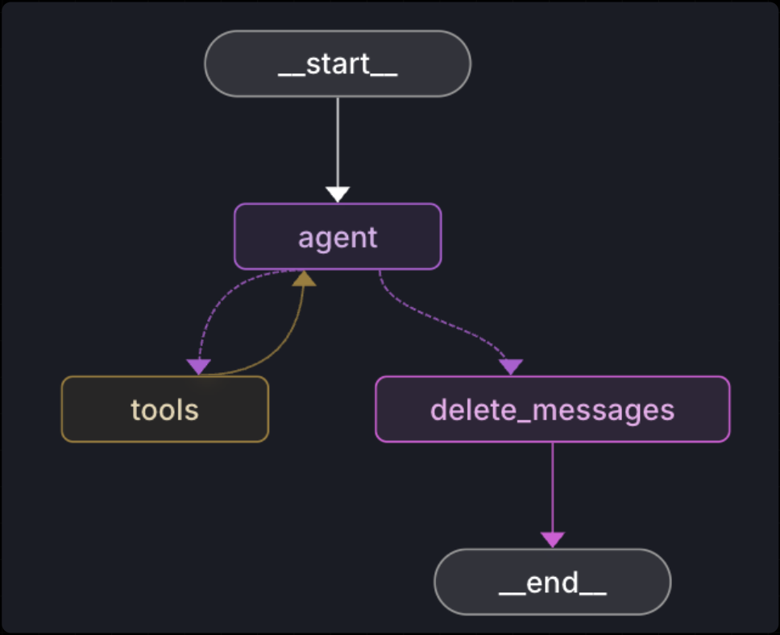

# GitLab Handbook RAG Agent — LangGraph Implementation

This repository hosts a **LangGraph-based agentic system** designed to query and reason over the GitLab Handbook using **Retrieval-Augmented Generation (RAG)** and **tool-calling workflows**.  

It demonstrates how to build a complete agent graph using **LangGraph Server**, visualize and debug it in **LangGraph Studio**, and deploy it locally or via Docker.

---

## 🧩 Overview

At its core, this project defines a **ReAct-style LangGraph agent** composed of multiple interconnected nodes that handle message routing, retrieval, tool execution, and cleanup.

The graph itself is defined in [`src/agent/graph.py`](./src/agent/graph.py), where each node represents a functional step in the agent workflow:

| Node | Description |
|------|--------------|
| **agent** | Core LLM reasoning node (uses `ChatOpenAI` from `langchain_openai`) for processing user input. |
| **tools** | Executes external functions such as search, retrieval, or pre-filtering of relevant handbook sections. |
| **should_continue** | Routing node that determines whether the workflow should continue or terminate based on the agent’s response. |
| **delete_messages** | Cleanup step that manages session state or message pruning for efficient runs. |

These nodes are connected via directed edges in a **LangGraph `StateGraph`**, enabling dynamic flow control and modular reasoning.

---

## 🧠 Graph Visualization

Here’s how the agent’s flow looks in LangGraph Studio:

<div align="center">
  
</div>

Each node is independently debuggable in LangGraph Studio — you can inspect intermediate state, replay from checkpoints, and hot-reload logic during development.

---

## ⚙️ Key Technologies

- **LangGraph** – For building and orchestrating the graph logic.  
- **LangChain OpenAI** – Provides `ChatOpenAI` model wrapper for LLM reasoning.  
- **Sentence Transformers (e5-base-v2)** – For lightweight embedding and semantic retrieval.  
- **MongoDB Atlas Vector Search** – For fast document similarity lookup and pre-filtered retrieval.  
- **Fast Iteration** – Designed for local development with `langgraph dev` or containerized deployment with `langgraph up`.  

---

## 🚀 Getting Started (Local Setup)

### 1. Clone the repository
```bash
git clone https://github.com/<your-username>/gitlab_handbook_agent.git
cd gitlab_handbook_agent
```

### 2. Create and activate a Conda environment

```bash
conda create -n gitlab_handbook_poc python=3.11 -y
conda activate gitlab_handbook_poc
```

### 3. Install dependencies

```bash
pip install -e . "langgraph-cli[inmem]"
pip install -r requirements.txt
```

### 4. Add your environment variables

Create a `.env` file in the root directory and include:

```bash
OPENAI_API_KEY=sk-...
LANGSMITH_API_KEY=lsv2-...
MONGODB_URI=...
ATLAS_DB=...
ATLAS_COLLECTION=...
```

### 5. Run LangGraph locally

```bash
langgraph dev --host 0.0.0.0 --port 2024 --config langgraph.json
```

🧭 **Access the Studio:**
Open LangGraph Studio in your browser.
You can now visualize, debug, and interact with your graph in real time.

---

## 🐳 Running via Docker

You can also run this project in a fully containerized setup using the built-in LangGraph Server stack.

### 1. Build your image

```bash
langgraph build -t gitlab-handbook-agent:latest
```

### 2. Run the container

```bash
docker run -p 2024:8000 \
  -e OPENAI_API_KEY=$OPENAI_API_KEY \
  -e LANGSMITH_API_KEY=$LANGSMITH_API_KEY \
  -e MONGODB_URI=$MONGODB_URI \
  -e ATLAS_DB=$ATLAS_DB \
  -e ATLAS_COLLECTION=$ATLAS_COLLECTION \
  gitlab-handbook-agent:latest
```

The container starts the LangGraph API server and exposes it at [http://localhost:2024](http://localhost:2024).

### 3. (Optional) Compose setup

If you prefer to deploy with persistent Postgres and Redis services:

```bash
docker compose up -d
```

The default setup will bring up:

* `langgraph-api` (your agent)
* `langgraph-postgres`
* `langgraph-redis`

You can then access the Studio at:

```bash
https://smith.langchain.com/studio/?baseUrl=http://localhost:2024
```

---

## 🧪 Development Workflow

* Hot-reload supported: updates to `graph.py` are auto-reflected in Studio.
* Inspect previous threads or states in LangGraph Studio.
* Modify the `Context` class and graph edges to extend your agent’s reasoning or retrieval flow.
* Logs, metrics, and traces are viewable via LangSmith (if enabled).

---

## 📚 References

* [LangGraph Documentation](https://langchain-ai.github.io/langgraph)
* [LangGraph Server Guide](https://langchain-ai.github.io/langgraph/concepts/langgraph_server/)
* [LangGraph Studio](https://smith.langchain.com/studio)
* [LangChain OpenAI API Reference](https://api.python.langchain.com/en/latest/langchain_openai.html)

---

## 🧾 License

This project is licensed under the **MIT License**.

**Author:** Atharva Kadam 

**Contact:** [atharvakadam@gmail.com](mailto:atharvakadam.dev@gmail.com)
